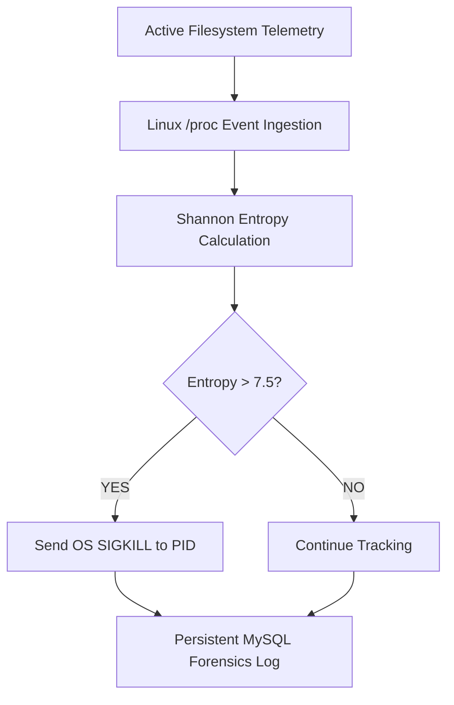

# Automated Endpoint Protection & Ransomware Mitigation Daemon


A lightweight host-monitoring daemon engineered in Python to detect and mitigate rapid, unauthorized filesystem encryption (ransomware) in real time using **Shannon Entropy analysis** over Linux process telemetry.

---



### Host Ingestion
Audits active file modification threads by continuously inspecting Linux `/proc` filesystem telemetry and process execution states.

### Entropy Engine
Computes Shannon Entropy

\[
H = -\sum p_i \log_2(p_i)
\]

across sliding file-write byte streams to detect high-entropy ransomware encryption activity.

### Automated Mitigation
Executes process termination using the native Linux **SIGKILL** signal, immediately stopping unauthorized encryption processes.

### Forensics Data Pipeline
Records:

- Process execution path
- Parent PID
- User context
- Entropy score
- Timestamp
- Detection status

into a persistent MySQL forensic database for incident response and post-attack analysis.

## 🛠️ Tech Stack & Key Tools
* **Language:** Python 3.10+
* **System Calls & OS:** Linux `procfs`, POSIX Signals (`SIGKILL`)
* **Data & Storage:** MySQL, SQL Pipelines
* **Algorithms:** Shannon Entropy Calculation, Thread Monitoring

---

## 🚀 Getting Started

### Prerequisites
* **OS:** Linux (Ubuntu 22.04+, Debian, Arch)
* **Python:** 3.10 or higher
* **Database:** MySQL Server 8.0+

### Installation & Execution

1. **Clone the Repository:**
   ```bash
   git clone [https://github.com/JanhN08/ransomware-mitigation-daemon.git](https://github.com/JanhN08/ransomware-mitigation-daemon.git)
   cd ransomware-mitigation-daemon
